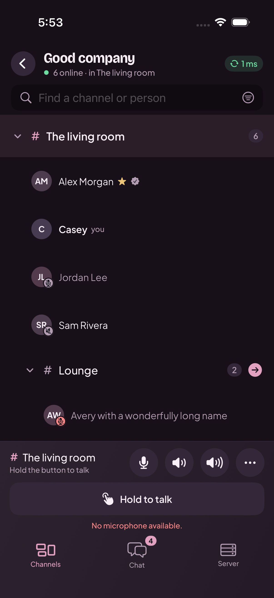

# Mutter

[Documentation](https://alaarab.github.io/mutter/) · [Phone comparison](https://alaarab.github.io/mutter/phone-layout.html)

Join a server, see who’s around, and talk. Mutter is a Mumble client for your browser,
iPhone, Android phone, or desktop, with voice, chat, and screen viewing in one place.

The phone apps keep channels, messages, and call controls in the same places. All four
clients share the same fonts and 11 themes, each with light and dark appearances.

<table>
  <tr><th>iPhone</th><th>Android</th></tr>
  <tr>
    <td></td>
    <td></td>
  </tr>
</table>

Actual simulator captures in Plum dark, using a test server and fictional participants.
The iPhone’s microphone warning comes from the simulator.
[See the phone layout comparison →](docs/phone-layout.md)

## What you can do

- Hold to talk, use voice activation, or leave the mic open. Mute yourself, deafen, or adjust
  someone’s volume without changing it for everyone else.
- Save your favourite servers, browse channels, and find people by name.
- Send messages and images to your channel or directly to someone.
- Share a screen or camera from the browser or Electron app, and watch from any Mutter client.
- Pick a theme you like and follow your device’s light or dark appearance.

Mutter connects to regular Mumble servers. Screen sharing is a Mutter extension, so viewers
need Mutter too. The [feature guide](docs/features.md) covers the differences between platforms.

## Try it

The browser client is a quick way to run from source. With Node 18+ and Chrome or Edge installed:

```sh
git clone https://github.com/alaarab/mutter.git
cd mutter
node web/bridge/server.mjs
```

The bridge serves Mutter at `http://localhost:8788` and opens an app window when it finds a
supported browser. Add your Mumble server’s address and username to connect.

For the other apps, start with the guide for your platform:

| App | What you need | Guide |
| --- | --- | --- |
| Browser | Node 18+ and Chrome or Edge for voice | [Run in a browser](web/README.md) |
| iPhone | Xcode, XcodeGen, and an iOS 17+ device or simulator | [Build and install on iOS](docs/ios.md) |
| Android | JDK 21, Android SDK 36, and an Android 10+ device or emulator | [Build and install on Android](android/README.md) |
| Electron | Node 22+ to run from source on Windows, macOS, or Linux | [Run the desktop app](desktop/README.md) |

The mobile apps connect directly to your server. The browser needs the local Node bridge
running; Electron includes it. Mobile builds currently use development signing—follow the
platform guide to install on your own device.

## Working on Mutter

The browser and Electron use the same web client. The phone apps use SwiftUI and Jetpack Compose,
with their own Mumble protocol implementations. Themes and fonts live together in `design/`.

If you’re changing the interface, start with the [design guide](docs/design.md) and
[shared phone layout](design/layout.md). Update the shared palette, then regenerate its outputs:

```sh
node scripts/generate-themes.mjs
node scripts/generate-themes.mjs --check
```

The latest Android layout pass, on September 7, 2026, passed 36 JVM and emulator tests and
reviewed all 22 theme variants. It also covered large text, landscape, permission recovery,
and live video from the desktop client. Microphone quality, Bluetooth accessories, and battery
behaviour still need physical Android testing. [Full validation notes](android/VALIDATION.md).

[Browse the docs](docs/README.md) for the source map, build guides, protocol notes, and test commands.
