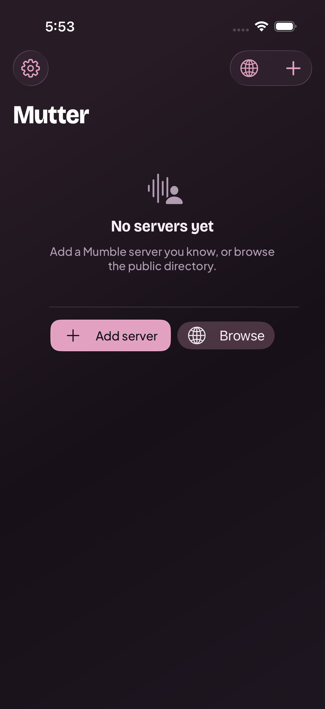
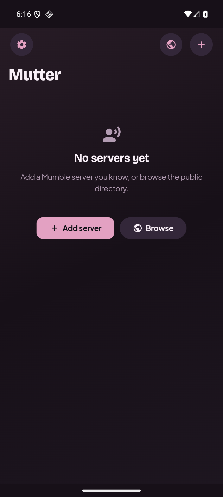
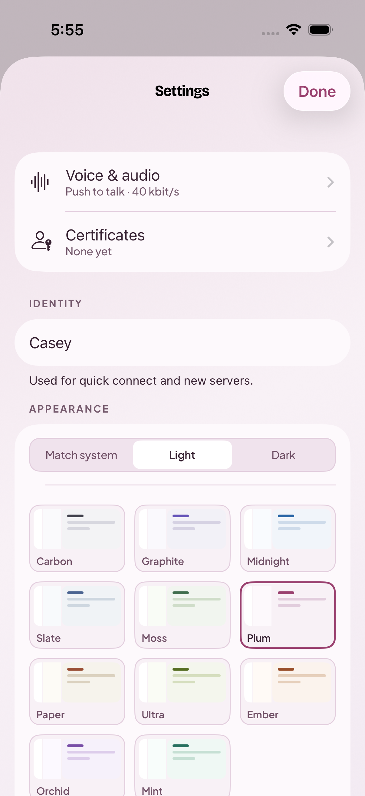
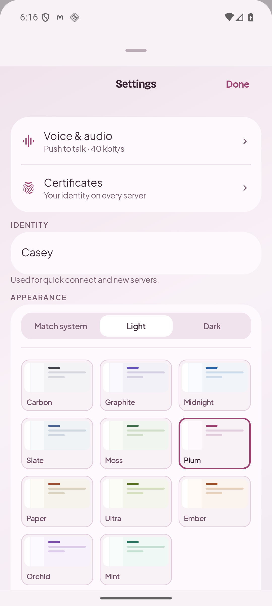
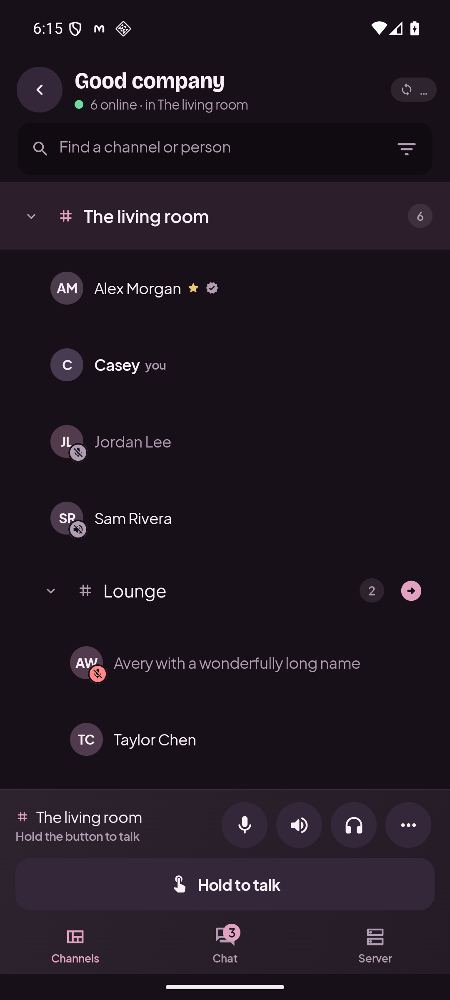
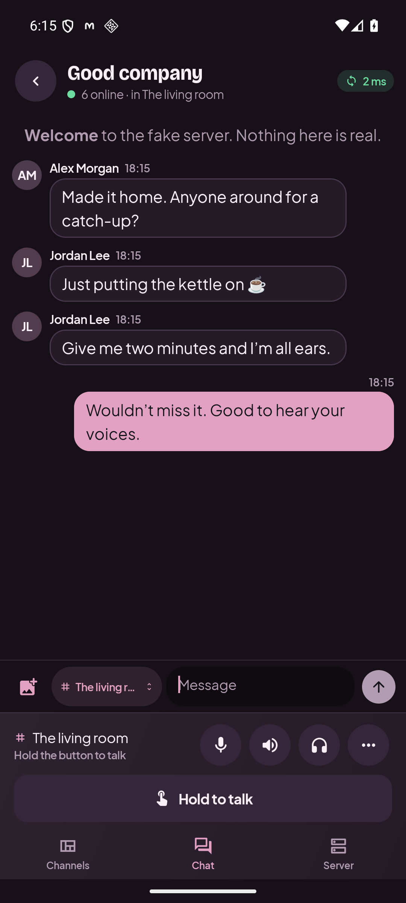

# Mutter on iPhone and Android

Switching phones shouldn’t mean learning where everything moved. Mutter’s Android app now
follows the iPhone layout: the same three tabs, people listed under their channels, and call
controls within reach at the bottom of the screen.

This page records the September 7, 2026 layout pass. The images are captures from the running
apps in the Plum theme. The channel and chat examples use fictional people on a test server.

## Side by side

### Home · Plum dark

Settings sits at the top left, with browsing and adding servers at the top right. Both apps
start with the same simple choices when you haven’t saved a server yet.

<table>
  <tr><th>iPhone · iOS 26.5</th><th>Android · Android 16</th></tr>
  <tr>
    <td></td>
    <td></td>
  </tr>
</table>

Settings · Plum light

Voice and certificates come first, followed by your default username, appearance, and behaviour
settings. Theme previews show the same colors you’ll see in the app.

<table>
  <tr><th>iPhone</th><th>Android</th></tr>
  <tr>
    <td></td>
    <td></td>
  </tr>
</table>

Channels and chat on Android · Plum dark

The Android session now follows the iPhone structure. Channels opens first, with people listed
inside their rooms and call controls below. Chat keeps incoming messages on the left, yours on
the right, and the destination beside the composer.

<table>
  <tr><th>Channels · Android</th><th>Chat · Android</th></tr>
  <tr>
    <td></td>
    <td></td>
  </tr>
</table>

Text on filled chat bubbles uses the shared foreground color. It’s dark on this theme’s pale
pink accent so messages stay readable.

## Where things belong

| Screen or control | Shared layout |
| --- | --- |
| Home | Settings at the top left; browse and add at the top right; saved servers below |
| Session header | Back, server name, people online, current channel, and latency |
| Tabs | Channels, Chat, Server, with Channels selected when you connect |
| Channels | Search, an indented tree, circular avatars, and status badges beside people |
| Call dock | Channel and voice status; mute, deafen, output, and more; push-to-talk below |
| Chat | Incoming messages left, your messages right, destination beside the composer |
| Server | Grouped server, connection, and identity details |
| Settings | Voice, certificates, identity, appearance, behaviour, and sharing |
| Profiles | Avatar beside the name and badges, then comment, personal mute, volume, and messaging |

Status bars, keyboards, permission prompts, and switches still follow their platform. Short
landscape windows put push-to-talk beside the other call controls and let search scroll with
the channel list. When the keyboard takes most of the screen, the input gets priority.

The browser and Electron keep their wider layouts while sharing Mutter’s colors, fonts,
and visual style. This pass changed the Android interface; the shipping iPhone interface
provided the reference.

## Colors that mean the same thing

All four clients draw from [the shared theme catalog](../design/themes.json). Each of its
11 themes has light and dark variants. Accent colors mark actions and selections; green means
voice or presence, red marks mute and errors, amber signals caution, and violet marks whisper
or video sharing. Avatars use colors from the active theme too.

The [design guide](design.md) explains the color roles, typography, and transitions. The palette
generator checks contrast, but screenshots still matter: opacity and surrounding surfaces can
change how a color reads in the app.

## What was checked

The September 7 pass compared an iPhone 17 Pro simulator running iOS 26.5 with an Android 16
ARM64 emulator. Channels were captured in all 22 Android theme variants. Chat, profiles, and
settings were also checked in light and dark appearances.

| Check | Result |
| --- | --- |
| JVM tests | 13 passed |
| Android instrumentation regression suite | 21 passed |
| Denied microphone permission and recovery | 1 passed |
| Live browser/Electron-client video received on Android | 1 passed |
| Small portrait and landscape at 150% text | 5 layout/editor tests passed in each configuration |
| Reduced motion | 3 layout tests passed |
| Debug build and lint | Passed, with zero lint errors |

That’s **36 distinct Android tests**; the size and motion runs repeat the layout tests. They
cover connections, voice transport, chat, navigation, saved settings, forms, and recovery.
The video check decoded real frames from the shared desktop client. The audited text colors
over the new backgrounds and message/avatar fills reached a minimum contrast of 4.62:1.

Physical Android testing is still needed for microphone quality, acoustic echo, Bluetooth
accessories, long background calls, and battery use. The [validation notes](../android/VALIDATION.md)
have the full results, test commands, and screenshot-capture instructions.

## Keeping the apps familiar

Use [the shared phone layout reference](../design/layout.md) when changing a phone screen.
Compare the running apps with the same theme, people, and voice mode, then check large text,
the keyboard, and a short landscape window. Keep colors in the shared catalog and reuse the
existing controls so a fix carries through the app.

[Back to the docs](README.md) · [Build Android](../android/README.md) · [Build iOS](ios.md)
